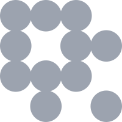

<Eyebrow>GraphCon · Seattle · July 25, 2026</Eyebrow>

# Multimodal Knowledge Graphs for Agents.

Let your agents move between fuzzy associations, graph facts, and multimodal evidence.

<GraphConPresenter />

::hero::

  

    
    

    <GraphVectorInterchange mode="cover" class="cover-network" />
  

<!--
Hi, and welcome to the world of multimodal knowledge graphs! Quick show of hands - how many of you have worked with graph databases and property graphs before?

And how many of you deal with multimodal data (images, video, audio, sensor traces, or anything that's not standard tabular data)?

Nice. Hopefully this talk is interesting. I'm Prashanth, I work as an AI Engineer at LanceDB. And this talk serves as a sequel to David Hughes' excellent talk from this morning. It blends the worlds of property graphs, which no doubt, lots of us here are familiar with, and hyperdimensional computing, which David talked about in the morning. It's intended to be educational, and not introducing the concepts that come together, so hopefully you all find this useful.
-->

---
layout: default
class: city-choice-slide
---

  <Eyebrow>A fuzzy question</Eyebrow>
  <h1>Which city fits this query?</h1>
  
<em>"Cities on the Pacific coast with mountains nearby.”</em>

  

    

      
      CANDIDATE 01
      Seattle, WA
    

    

      
      CANDIDATE 02
      Salt Lake City, UT
    

    

      
      CANDIDATE 03
      New York City, NY
    

  

  

    

      
mountainswaterfrontpacific coast

    

    

      
mountainsnature accessinland

    

    

      
dense skylineriverfronturban energy

    

  

  
What evidence did your mind combine before you chose?

<!--
Let's start with a quick question. We have three cities: Seattle, Salt Lake City, and New York. Which one fits “Cities on the Pacific coast with mountains nearby?”

It shouldn't take more than a second to choose between these three options.

Hopefully, most of us chose Seattle. But notice what happened before you answered. Your mind combined multiple kinds of evidence. You probably didn't match one exact phrase against one stored field. We know Seattle has mountains nearby, a waterfront, and a Pacific coast location. Even if we didn't have every fact memorized, some of that evidence is visible in the image. Those signals reinforce one another.

Salt Lake City is an interesting candidate because it isn't random noise. It strongly matches mountains and access to nature, but it is inland. New York has a dense skyline and plenty of waterfront, but it does not fit the Pacific-and-mountains combination. So there are degrees of association here.

This distinction will matter later. We expect Seattle to rank highest, but we also want our representation to preserve why Salt Lake City is a plausible partial match.

What your mind just did was combine several individually weak but compatible signals. We haven't thought in terms of graphs, or databases, but rather, combining these connected facts in some intangible way in our minds. That is the pattern we want to reproduce for agents.
-->

---
layout: default
class: association-slide
---

  <Eyebrow>How humans search</Eyebrow>
  <h1>
    We don't just look for exact matches. 
    We associate, based on how things are connected.
  </h1>
  

    The answers often depend on a relationship that was never recorded in the data.
  

  

    

      

        
        IMAGE
        a skyline
      

      

        PLACE
        <svg viewBox="0 0 180 150" aria-label="Abstract map of coast and mountains">
          <path class="map-water" d="M0 0 H52 C78 20 42 43 67 65 C89 84 46 108 72 150 H0 Z" />
          <path class="map-road" d="M70 10 C118 38 92 82 158 132" />
          <path class="map-road secondary" d="M52 108 C88 92 116 94 171 55" />
          <path class="map-range" d="M73 62 L94 36 L109 55 L128 24 L157 63" />
          <circle class="map-pin-ring" cx="111" cy="89" r="11" />
          <circle class="map-pin" cx="111" cy="89" r="4" />
        </svg>
        coast + mountains
      

      

        LANGUAGE
        

          Pacific coast
          mountains nearby
          people who visited
        

        fuzzy intent
      

    

    

      
      <i></i>
    

    

      ASSOCIATION
      <svg class="board-lines" viewBox="0 0 310 190" aria-hidden="true">
        <g fill="none" stroke="#ff734a" stroke-opacity="0.52" stroke-width="1.6">
          <path d="M58 51 L153 90 L250 48" />
          <path d="M58 51 L83 148 L153 90 L238 146" />
          <path d="M250 48 L238 146 L153 90" />
        </g>
      </svg>
      skyline
      Pacific
      Seattle
      mountains
      people
      relationships our minds <i>intuitively</i> inferred
    

  

  
<em>“Persons who visited cities on the Pacific coast with mountains nearby.”</em>

<!--
That subconscious thought process demonstrates something we humans do intuitively: we associate, rather than looking for an exact match.

Let's extend the previous question: “Which *persons* visited cities on the Pacific coast with mountains nearby?” We added one factual graph relationship: a person VISITED a location.

Our minds construct an image of a location that's a city, bringing to mind the image of a skyline, which is a characteristic feature of a city. We also think of the notion of geography - The Pacific ocean is on the west coast, and not all cities there have mountains. Before the word "Seattle" comes to mind, these associations are all taking place beforehand.

This is the essence of associative search: rather than directly looking for a city that fits the description, the concepts can connect together in a way that that city, and to the people who visited it. The natural way to think about this kind of data is a graph.
-->

---
layout: default
class: dataset-schema-slide
---

  <Eyebrow>The dataset</Eyebrow>
  <h1>A simple graph, made multimodal.</h1>
  
Four people, three cities, one relationship table, with a skyline image of every city.

  

    

      
IN THIS DEMO

      

        
<strong>4</strong>Person (nodes)

        
<strong>3</strong>Location (nodes)

        
<strong>4</strong>VISITED (edges)

      

      

        
<b>Maya · Robby</b><i>-[:VISITED]-&gt;</i><strong>Seattle</strong>

        
<b>Elena</b><i>-[:VISITED]-&gt;</i><strong>Salt Lake City</strong>

        
<b>Andre</b><i>-[:VISITED]-&gt;</i><strong>New York</strong>

      

      

        
IMAGE_PATHNAMEDESCRIPTION

        

          
<small>img/seattle.jpg</small>

          <strong>Seattle</strong>
          
Pacific Northwest city on Puget Sound with Cascade and Olympic mountain views.

        

      

    

    

      
PROPERTY-GRAPH CONTEXT<small>gray = plausible larger schema, not present in this dataset</small>

      <svg viewBox="0 0 660 350" role="img" aria-label="Graph schema highlighting Person VISITED Location with grayed Company and Country context">
        <defs>
          <marker id="active-schema-arrow" markerWidth="10" markerHeight="10" refX="8" refY="4" orient="auto"><path d="M0,0 L0,8 L9,4 z" fill="#ff734a"/></marker>
          <marker id="ghost-schema-arrow" markerWidth="10" markerHeight="10" refX="8" refY="4" orient="auto"><path d="M0,0 L0,8 L9,4 z" fill="#81766d"/></marker>
        </defs>
        <g class="ghost-schema">
          <path d="M145 155 C188 126 233 106 277 92" marker-end="url(#ghost-schema-arrow)"/>
          <path d="M480 190 C514 198 536 217 553 239" marker-end="url(#ghost-schema-arrow)"/>
          <g class="ghost-edge-label">
            <rect x="187" y="113" width="74" height="22" rx="6" class="ghost-edge-chip"/>
            <text x="224" y="128" class="ghost-edge-text">WORKS_AT</text>
          </g>
          <g class="ghost-edge-label">
            <rect x="495" y="203" width="84" height="22" rx="6" class="ghost-edge-chip"/>
            <text x="537" y="218" class="ghost-edge-text">LOCATED_IN</text>
          </g>
          <g transform="translate(267 17)">
            <circle cx="48" cy="48" r="48"/>
            <text x="48" y="53" class="node-type">Company</text>
          </g>
          <g transform="translate(542 222)">
            <circle cx="48" cy="48" r="48"/>
            <text x="48" y="53" class="node-type">Country</text>
          </g>
        </g>
        <g class="active-schema">
          <path d="M160 190 H215"/>
          <path d="M325 190 H380" marker-end="url(#active-schema-arrow)"/>
          <rect x="215" y="176.5" width="110" height="27" rx="6" class="edge-chip"/>
          <text x="270" y="193.5" class="edge-text">VISITED</text>
          <text x="270" y="220" class="edge-helper">conceptually: has visited</text>
          <g transform="translate(30 130)">
            <circle cx="80" cy="60" r="50"/>
            <text x="80" y="67" class="active-type">Person</text>
          </g>
          <g transform="translate(350 130)">
            <circle cx="80" cy="60" r="50"/>
            <text x="80" y="58" class="active-type">Location</text>
            <text x="80" y="80" class="active-subtype">(city)</text>
          </g>
        </g>
        <g class="schema-legend" transform="translate(42 328)">
          <line x1="0" y1="0" x2="34" y2="0" class="active-line"/>
          <text x="44" y="5">loaded demo path</text>
          <line x1="205" y1="0" x2="239" y2="0" class="ghost-line"/>
          <text x="249" y="5">larger graph context</text>
        </g>
      </svg>
    

  

  
This is the complete data we will encode: <strong>people, city locations, one relationship type, and multimodal evidence.</strong>

<!--
Let's concoct a small property graph dataset that answers this kind of question. We have four persons, three city locations, and four recorded visits of those persons to those locations. Maya and Robby visited Seattle, Elena visited Salt Lake City, and Andre visited New York.

The property graph on the right should look quite familiar:
a Person connected to a Location by a Visited relationship. The gray Company
and Country nodes are there just to show how this is how such a subgraph could sit inside a larger, more realistic property graph. We won’t actually model them in this example, so we'll just focus on the person -> visited -> Location relationship for the rest of this talk.

The multimodal aspect of this dataset is in the Location data. Each city has the usual structured fields, but it also carries an image of the skyline and a natural-language description, which we'll look at more in the upcoming slides. So the visual evidence is part of the same location entity that's in the graph.

The next question is whether storing this kind of data can help answer the fuzzy query we just asked.
-->

---
layout: default
class: schema-gap-slide
---

  <Eyebrow>Retrieving facts when the question is fuzzy</Eyebrow>
  <h1>A knowledge graph doesn't have the answer (yet)</h1>
  
"Open world problem": The graph is never <i>truly</i> complete (relationships are missing).

  

    

      
Location<small>structured graph fields · simplified</small>

      
<code>name</code>Seattle

      
<code>region</code>pacific_northwest

      
<code>timezone</code>pacific

      
<code>pacific_coast</code>NOT MODELED

      
<code>mountains</code>NOT MODELED

    

    

      
Exact Cypher attempt<small>valid pattern · missing predicates</small>

      <pre class="cypher-code">MATCH (p:Person)-[:VISITED]-&gt;(loc:Location)
WHERE loc.pacific_coast = true
  AND loc.mountains = true
RETURN p.name, loc.name</pre>
      
∅
<strong>0 rows</strong><small>Both properties evaluate as missing.</small>

    

  

  
The evidence exists, <strong> but the schema never named the relationship.</strong>

<!--
There's a fundamental issue with knowledge graphs: the open world assumption. Data that exists in the real world is always missing from the graph. Just because the graph doesn't capture it, it doesn't mean that the data doesn't exist - we just don't know it yet.

The Cypher query on the right shows how we start with a Person, follow
a Visited relationship, match on features, and arrive at a Location. The traversal isn’t the problem. In this case, the designer of the graph never decided to store the features "pacific coast" or "mountains". So if these aren't explicitly named, we don't get a match. A MATCH query in Cypher is :all or nothing", especially if you have filters involved.

We could, of course, keep adding more and more features as properties every time a new question appears. But that becomes brittle and hard to manage very quickly, especially when the evidence is fragmented across different sources.

So it's not that graphs + traditional vector search over the properties can’t help answer fuzzy questions. This is essentially, the GraphRAG pattern we've all gotten so familiar with. But even with traditional vector search, we can only go so far as capturing the the semantics of text properties on nodes in the graph. The graph structure itself, is left to a graph database.
-->

---
layout: default
class: spaces-are-graphs-slide
---

  <Eyebrow>The bridge</Eyebrow>
  <h1>Really high-dimensional spaces are like graphs.</h1>
  
The goal: blend the intuition of vectors with the facts of graphs.

  <GraphVectorInterchange class="spaces-interchange-animation" />
  

    
<strong>High-dimensional vector space:</strong>What the model <em>feels</em> <small>(probabilistic/intuitive)</small>

    
<strong>Graphs:</strong>What we <em>know</em> from data <small>(deterministic/factual)</small>

  

<!--
Let's now understand some fundamental intuitions about higher-dimensional geometries. As we know, a graph is a discrete representation of something we can also express in a continuous, very
high-dimensional space.

We start with a very familiar graph representation: a finite set of nodes and edges. The fuzzy manifold you see is essentially a 3D projection of a much higher-dimensional space that models the same graph data. And importantly, this isn’t just
an embedding space produced from the text properties on those nodes. This is what we call
hypervector space, which we’ll define more rigorously in the next few slides as we introduce hyper-dimensional computing.

As the two representations move together, observe the part of the animation that shows the graph isn’t being placed inside the space as a discrete graph that stays intact. The information in the graph is being re-encoded. A node, a relationship, or a larger piece of graph structure can
all be represented as hypervectors in this high-dimensional space, and then composed using algebra.

Consider two nodes from our graph that represent very different concepts: a Person and a
Location. In the animation, those nodes move to a common origin and become two
arrows. The direction of each arrow carries its identity. The Person
hypervector points in one direction, while the Location hypervector points in
a very different, nearly orthogonal direction. In fact, the shape of this manifold is decided by each and every one of these hypervectors, which all point in different directions and have different magnitudes. Concepts that are similar, like person or location, tend to have hypervectors that are pointing in the same direction, that is, they have a high cosine similarity in this space.

This idea is especially powerful because in this high-dimensional space with hypervectors,
we can encode not only nodes and their properties,  but also entire paths including
the relationships between nodes. We’ll see the actual
operations that make that possible shortly.

So the graph and this high-dimensional projected manifold are modeling the same underlying data
in two different ways. One is discrete and explicit. The other is continuous
and distributed. The graph is very good at stating what we know as fact, while
the high-dimensional representation gives us a way to work with softer,
associative evidence.

That connection brings us to the fascinating topic at the center of this talk:
hyperdimensional computing, or HDC.
-->

---
layout: default
class: hdc-overview-slide
---

  <Eyebrow>Introducing Hyper-Dimensional Computing (HDC)</Eyebrow>
  <h1>HDC represents concepts as very wide vectors.</h1>
  
A <strong>hypervector</strong> is simply a high-dimensional vector (10K+ or more dimensions), generated by an <i>encoder</i>

  

    

      ONE CONCEPT
      <strong>Seattle</strong>
      

      
<b>often 10,000 values</b> working together as one representation

    

    <ul class="hdc-simple-steps">
      <li><b>Encode.</b> Give each concept, such as <code>Person</code>, <code>Seattle</code>, or <code>VISITED</code>, its own long, reproducible hypervector.</li>
      <li><b>Compose.</b> Use simple algebraic operations to combine them, producing new hypervectors that can represent a fact or a set of facts.</li>
      <li><b>Retrieve.</b> Compare hypervectors by similarity. The closest ones point toward related concepts and the most relevant candidate answers.</li>
    </ul>
  

  
HDC turns symbolic structure into <strong>geometry we can search, using algebra.</strong>

  

    <a href="https://redwood.berkeley.edu/wp-content/uploads/2018/01/kanerva2009hyperdimensional.pdf" target="_blank" rel="noopener"><b>FOUNDATION</b>Kanerva · “Hyperdimensional Computing” · Cognitive Computation, 2009</a>
    <a href="https://arxiv.org/abs/2106.05268" target="_blank" rel="noopener"><b>PRACTITIONER LENS</b>Kleyko et al. · “Vector Symbolic Architectures as a Computing Framework for Emerging Hardware” · Proc. IEEE, 2022</a>
  

<!--
So what exactly is hyperdimensional computing?

At the simplest level, HDC represents and manipulates information using very
wide vectors: around ten thousand dimensions here, and sometimes more. We call
one of these objects a hypervector.

The strip on the left is a compressed illustration of one hypervector for
Seattle. Seattle isn’t stored in one coordinate or one small section. Its
identity is distributed across the entire pattern, so no individual dimension
has to carry the meaning by itself.

An encoder turns a concept or a piece of data into one of these vectors. There
are several kinds of encoders. In the simple construction we’ll use, Person,
Seattle, and Visited each receive a long, reproducible hypervector. We don’t
train a deep network to discover those initial directions. A seeded process can
generate them once and recreate them whenever we need them.

From there, HDC gives us the three parts on the right.

First, we encode: each concept gets its own hypervector.

Then, we compose. We can combine Person, Visited, and Seattle to encode a richer
fact, such as a person visiting Seattle. The result is still a hypervector of
the same width; it doesn’t grow as we add structure.

Finally, we retrieve. We compare a query with stored hypervectors, usually using
cosine similarity, and the closest representations point toward related concepts
or candidate answers.

Again, it's worth lingering on the fact that isn’t simply a conventional text embedding. The hyperdimensional geometry reflects symbols, roles, types, relationships, and their combinations we chose to encode. The graph’s structure has been translated into vector algebra.

If this is new to you, I strongly recommend the two papers at the bottom.
Pentti Kanerva’s 2009 paper, “Hyperdimensional Computing,” is the foundational
introduction and introduces the concepts of HDC. Kleyko and colleagues’ “Vector Symbolic Architectures as a Computing Framework for Emerging Hardware” gives a broader, more modern, practitioner lens.

So that’s the basic loop: represent, compose, and retrieve.
-->

---
layout: default
class: orthogonality-slide
---

  <Eyebrow>Why the dimensions matter</Eyebrow>
  <h1>Random hypervectors barely collide.</h1>
  
In 10,000 dimensions, unrelated bipolar vectors concentrate tightly around cosine similarity zero.

  

    

      
2,000 random vector pairs<small>seed 13 · d = 10,000</small>

      

        
−σ

0

+σ

        <i style="--bar:1%"></i><i style="--bar:1%"></i><i style="--bar:2%"></i><i style="--bar:9%"></i><i style="--bar:25%"></i><i style="--bar:49%"></i><i style="--bar:84%"></i><i style="--bar:99%"></i><i style="--bar:100%"></i><i style="--bar:83%"></i><i style="--bar:43%"></i><i style="--bar:24%"></i><i style="--bar:11%"></i><i style="--bar:2%"></i><i style="--bar:1%"></i><i style="--bar:1%"></i>
      

      
−0.04−0.02cosine similarity+0.02+0.04

    

    

      
mean<strong>−0.0001</strong><small>essentially zero</small>

      
observed σ<strong>0.0101</strong><small>2,000 pairs</small>

      
expected scale<strong>1 / √d ≈ 0.01</strong><small>for d = 10,000</small>

    

  

  
The encoder defines the geometry. <strong>High dimensionality protects it from accidental hypervector similarity.</strong>

  <a class="kanerva-link" href="https://redwood.berkeley.edu/wp-content/uploads/2018/01/kanerva2009hyperdimensional.pdf" target="_blank" rel="noopener">↗ Pentti Kanerva · “Hyperdimensional Computing” · Cognitive Computation, 2009</a>

<!--
Why does the high dimensionality matter? Why did we choose 10 thousand dimensions and not fewer? We can run a  simple experiment to convince ourselves why this matters.

We generate two thousand independent pairs of 10 thousand-dimension, bipolar hypervectors (bipolar means the values in the hypervector are are discrete integers between -1 and +1).  We then measure the cosine similarity within each pair and plot
the two thousand scores as this histogram.

If unrelated hypervectors frequently collided, we’d see many scores spread far
away from zero. Instead, the distribution is extremely narrow and centered
almost exactly at zero. The observed mean is effectively
zero, and the standard deviation is about 0.01. That matches the expected scale
of one divided by the square root of ten thousand.

This doesn’t mean an accidental collision is mathematically impossible. It means
that at this dimensionality, independently generated hypervectors are overwhelmingly
likely to begin nearly orthogonal to one another. That gives our codebook entries
plenty of room to remain distinct before we start overlapping concepts between them.

Now that we have stable atomic hypervectors that rarely collide by accident, we
can move to the three basic operators of HDC, allowing us to manipulate these hypervectors using algebra.
-->

---
layout: default
class: binding-slide
---

  <Eyebrow>HDC operation 1 · binding (association)</Eyebrow>
  <h1>Binding connects a concept to its features and types.</h1>
  
A "feature" is the role, it's value is a <i>bound association</i> to the <code>Location</code> node type.

  

    

      

        
<small>ROLE</small><strong>key:feature</strong><i class="association-vector seattle-vector"></i>

        <b class="association-symbol">⊗</b>
        
<small>VALUE</small><strong>value:mountains</strong><i class="association-vector mountains-vector"></i>

        <b class="association-arrow">→</b>
        
<small>ASSOCIATION</small><strong>feature → mountains</strong><i class="association-vector bound-mountains-vector"></i>

      

      

        
<small>ROLE</small><strong>key:feature</strong><i class="association-vector seattle-vector"></i>

        <b class="association-symbol">⊗</b>
        
<small>VALUE</small><strong>value:pacific_coast</strong><i class="association-vector coast-vector"></i>

        <b class="association-arrow">→</b>
        
<small>ASSOCIATION</small><strong>feature → pacific_coast</strong><i class="association-vector bound-coast-vector"></i>

      

      

        
<small>NODE TYPE</small><strong>type:Location</strong><i class="association-vector location-vector"></i>

        <b class="association-symbol">⊗</b>
        
<small>FEATURE ASSOCIATION</small><strong>Amountains</strong><i class="association-vector bound-mountains-vector"></i>

        <b class="association-arrow">→</b>
        
<small>LOCATION FEATURE</small><strong>Location → feature:mountains</strong><i class="association-vector location-mountains-vector"></i>

      

    

    

      <small>TWO REVERSIBLE BINDINGS</small>
      <strong>Unbind the node type, then the feature role.</strong>
      <code>Lmountains ⊗ TLocation = Amountains Amountains ⊗ Rfeature = <b>Vmountains</b></code>
      
One layer says what kind of node; the next recovers the feature value.

      

        <small>KEY</small>
        <b>L</b> → Location
        <b>T</b> → Type
        <b>R</b> → Role
        <b>A</b> → Association
      

    

  

  
<code>Lmountains = TLocation <b>⊗</b> (Rfeature <b>⊗</b> Vmountains)</code><small>type → role → value = association</small>

  
<strong>Binding can store both meaning and scope:</strong> “mountains is a feature of a Location.”

<!--
Let’s begin from something familiar in a property graph, which use the familiar key-value notation to store properties. In this case, the key is "feature", and its value is "mountains'. To create the association between "feature" and "mountains", we use the BIND operator.

You can simply think of binding as association. Binding associates the role
“feature” with the value “mountains,” just as a graph property associates its
key with its value.

For the implementation, we use a library called TorchHD. TorchHD supports a few
different ways of doing this vector arithmetic. We use its MAP model, which
stands for Multiply, Add, and Permute. You don’t need to memorize that name.
For the purposes of this talk, all we need to know is that binding is like element-wise multiplication.

Look at the first row. We line up the hypervector for “feature” with the
hypervector for “mountains,” then multiply matching positions. First by first,
second by second, across all ten thousand positions. The result is still one
ten-thousand-dimensional hypervector, but now it represents the association
“feature equals mountains.”

The second row repeats the same operation for Pacific coast. We reuse the same
property key, “feature,” and associate it with a different value.

The third row adds the node type. In graph terms, this is like saying that the
property belongs to a node labeled Location. Read the equation from the inside
out: associate the key with the value, then associate that result with the
Location type. All of these are atomic operations on individual featured, or roles, or types.

On the right, you can see the most useful property of binding: it’s invertible.
Because our bipolar hypervectors contain only plus ones and minus ones, multiplying by the
same known factor a second time inverts it. Unbind the Location association and
we get back “feature equals mountains.” Unbind the feature association and we
get back “mountains.”

So binding is the high dimensional vector-space equivalent of creating a typed property
association. We now have several of those associations, individually. Next, we need to collect
them into one representation, via bundling.
-->

---
layout: default
class: bundling-slide
---

  <Eyebrow>HDC operation 2 · bundling (superposition)</Eyebrow>
  <h1>Bundling combines many representations into one.</h1>
  
Bundle the Location-scoped feature vectors into one hypervector while preserving each feature's contribution.

  

    

      
<small>LOCATION FEATURE L₁</small><strong>Location → feature:mountains</strong><code>TLocation ⊗ Amountains</code><i class="association-vector location-mountains-vector"></i>

      
<small>LOCATION FEATURE L₂</small><strong>Location → feature:pacific_coast</strong><code>TLocation ⊗ Apacific_coast</code><i class="association-vector location-coast-vector"></i>

    

    
<strong>⊕</strong>BUNDLE<small>superpose the associations</small>

    

      <small>CONCEPTUAL LOCATION FEATURE BUNDLE</small>
      <strong>One semantic component</strong>
      <i class="node-vector-stripe"></i>
      
mountains ✓pacific_coast ✓

      
Bundling preserves both contributions without increasing the vector width.

    

  

  

    <code>Bfeatures = Lmountains <b>⊕</b> Lpacific_coast ⊕ …</code>
    <small>superposition of Location features</small>
  

  

    <b>REMOVE</b> Bfeatures − Lmountains = the remaining features
    <b>RESTORE</b> remaining features ⊕ Lmountains = Bfeatures
  

  
<strong>Binding creates the associations; bundling combines them.</strong> Next, the encoder applies both operations to the complete Seattle node.

<!--
Bundling is the second operator of HDC. You can think of bundling as superposition:
combining several representations into the same space while keeping the essence of
each one. A useful analogy is stacking transparent colored sheets. Each sheet contributes
to the combined image, but you can still recognize parts of the individual
layers.

In the MAP approach of HDC, bundling is like element-wise addition. We line up the bound
hypervectors from the previous slide and add their matching positions. Each association contributes a small vote at every position, and the bundle stores the total. The values may now
be counts such as minus two, zero, or plus two, but the vector is still has the same ten
thousand dimensions.

On the right, we have one conceptual semantic component: mountains and Pacific
coast bundled into the same vector. This is deliberately not the complete
Seattle node yet. It isolates the operation so we can see what bundling does
before the next slide applies it to all of the Location data.

The important idea here is that a bundled hypervector remains somewhat similar to every
association that's inside it. That’s what makes it searchable. If a later query
contains mountains, it can still match the larger Seattle bundle, even if the
query doesn’t contain every other Seattle feature. Unlike a discrete graph that needs an exact match via the query, this bunded hypervector behaves like partial matching over a collection of properties.

At the bottom you can see that just like binding, bundling is also invertible. If we don't to associate
Seattle with mountains, we unbundle (or subtract) that association from the running
total. If we want it back, we bundle (or add) it again. This is basically like updating a distributed memory with vector arithmetic. More on that towards the end of this talk.

So, to summarize, binding is association, bundling is superposition.
-->

---
layout: default
class: semantic-projection-slide
---

  <Eyebrow>Applying binding and bundling</Eyebrow>
  <h1>How is the hypervector encoded?</h1>
  
Every property contributes. The projected semantic evidence is weighted so its geometry remains visible inside the structural bundle.

  <section class="semantic-projection-visual" aria-label="The complete Seattle Location row is encoded as a structural property sum and an eight-times-weighted semantic hypervector, then bundled into one full Location hypervector">
    

      

        <small>STRUCTURAL VIEW · COMPLETE LOCATION ROW</small>
        <strong><code>name</code> Seattle · <code>kind</code> Location · <code>region</code> pacific_northwest · <code>timezone</code> pacific · …</strong>
        bind every key to its value, then bundle → <b>structural sum</b>
      

      

        <small>SEMANTIC VIEW · LOCATION EVIDENCE</small>
        <strong>“Mountain skyline · Puget Sound · Pacific Northwest”</strong>
        Text embedding model produces the normalized 768-dim embedding below.
      

    

    

      

        <small>NOMIC-EMBED-TEXT</small>
        <strong>1 × 768</strong>
        

          <i class="vneg"></i><i class="vpos"></i><i class="vpos"></i><i class="vneg"></i><i class="vneg"></i><i class="vpos"></i><i class="vpos"></i><i class="vneg"></i><i class="vpos"></i><i class="vneg"></i><i class="vpos"></i><i class="vneg"></i>
        

        768 continuous values
      

      <b class="projection-operator">×</b>
      

        <small>FIXED RADEMACHER MATRIX · R</small>
        <strong>768 × 10,000</strong>
        

          768 rows
          

            <i class="rp">+</i><i class="rn">−</i><i class="rp">+</i><i class="rp">+</i><i class="rn">−</i><i class="rn">−</i><i class="rp">+</i><i class="rn">−</i>
            <i class="rn">−</i><i class="rn">−</i><i class="rp">+</i><i class="rn">−</i><i class="rp">+</i><i class="rp">+</i><i class="rn">−</i><i class="rp">+</i>
            <i class="rp">+</i><i class="rn">−</i><i class="rn">−</i><i class="rp">+</i><i class="rp">+</i><i class="rn">−</i><i class="rp">+</i><i class="rn">−</i>
            <i class="rn">−</i><i class="rp">+</i><i class="rp">+</i><i class="rn">−</i><i class="rn">−</i><i class="rp">+</i><i class="rn">−</i><i class="rp">+</i>
            <i class="rp">+</i><i class="rp">+</i><i class="rn">−</i><i class="rn">−</i><i class="rp">+</i><i class="rn">−</i><i class="rn">−</i><i class="rp">+</i>
            <i class="rn">−</i><i class="rp">+</i><i class="rn">−</i><i class="rp">+</i><i class="rn">−</i><i class="rp">+</i><i class="rp">+</i><i class="rn">−</i>
          

          10,000 columns
        

      

      

        <code>sign</code>
        weighted majority vote
      

      <b class="projection-operator">=</b>
      

        <small>TRANSIENT SEMANTIC HYPERVECTOR</small>
        <strong>1 × 10,000</strong>
        

          <i class="rp"></i><i class="rn"></i><i class="rp"></i><i class="rp"></i><i class="rn"></i><i class="rp"></i><i class="rn"></i><i class="rn"></i><i class="rp"></i><i class="rn"></i><i class="rp"></i><i class="rp"></i><i class="rn"></i><i class="rn"></i><i class="rp"></i><i class="rp"></i><i class="rn"></i><i class="rp"></i><i class="rn"></i><i class="rn"></i><i class="rp"></i><i class="rn"></i><i class="rp"></i><i class="rp"></i><i class="rp"></i><i class="rn"></i><i class="rn"></i><i class="rp"></i><i class="rn"></i><i class="rp"></i><i class="rp"></i><i class="rn"></i><i class="rp"></i><i class="rn"></i><i class="rn"></i><i class="rp"></i><i class="rn"></i><i class="rp"></i><i class="rp"></i><i class="rn"></i><i class="rn"></i><i class="rp"></i><i class="rp"></i><i class="rn"></i><i class="rp"></i><i class="rn"></i><i class="rp"></i><i class="rn"></i>
        

        10,000 bipolar values
      

    

    

      <code>semantic_hv = sign(xR) &nbsp; where &nbsp; x ∈ ℝ1×768, &nbsp; R ∈ {−1,+1}768×10,000</code>
      <code class="node-sum-equation">Location.hv = structural_hv + 8 × semantic_hv</code>
    

    

      
<small>STRUCTURAL COMPONENT</small><code>⊕ (key ⊗ value)</code>

      <b>⊕</b>
      
<small>WEIGHTED SEMANTIC COMPONENT</small><code>8 × semantic_hv</code>

      <b>→</b>
      
<small>NODE HYPERVECTOR</small><strong>Seattle · <code>Location.hv</code></strong>

      the only Location vector persisted
    

  </section>
  
<code>Location.hv</code> is both the complete node representation and the vector searched by semantic queries.

<!--
Now that we have seen binding and bundling separately, we can look at how we encode the
notion of a "Location". An encoder's job is to produce a hypervector of the specified dimensionality from the specified inputs. To encode the meaningful representation of a node, we'd need to combine binding and bundling into our encoder design.

There are two components we use: a structural component, and a semantic component.
The structural path starts with every property in the Location row:
the name, node kind, region, timezone, description, image path, and the other
fields, and hashes these symbolic tokens into a seeded random value, which is then used to generate the 10 thousand dimensional hypervector.

Then, we have a semantic component begins with the location description, which is a traditional text field that describes the location. We use a traditional text embedding model here, to converts that text into a normalized text embedding with 768 dimensions.  As we know, this captures semantic meaning in the text description. That's the left strip in this slide (with the coarse bars), with the blue values indicating positive floats and the grey values indicating negative floats.

But now we have a problem: our semantic component is only 768 dimensions in size, but our hypervectors need to be 10 thousand dimensions in size.

The answer is this: We project the lower dimensional text embedding up into hypervector space.
The math works something like this.
We multiply that row by one fixed discrete random matrix (called a Rademacher matrix), which
768 by 10000, Every value in this matrix is either plus one or minus one.
The intuition with why we multiply is that the output column can be thought of
as a weighted majority vote: the column either keeps or flips each of the 768
semantic twxt embedding values, so we add those contributions, and
the sign of the result (not its value) what we use for the hypervector. A positive total
becomes plus one; a negative total becomes minus one. Doing that for all ten thousand columns
produces the 10 thousand dimension bipolar semantically encoded
hypervector on the right, which is what we want.

Finally, to combine them into a "Seattle node" hypervector,
the encoder bundles the structural sum with eight copies of the
semantic hypervector. The semantic weight prevents its geometry from being
diluted by the ten structural property associations in this Location schema.
The resulting Location dot hv is the complete node representation for Seattle
and the only Location hypervector persisted.

Why did we do all this? So that a query that's something like  “mountainous cities
near the Pacific Ocean” , which doesn't exactly name the word "mountain",
is still encoded semantically, but it's now compared
directly with the complete Seattle node hypervector representation. So we can really
capture some fuzzy intent in the queries this way in hypervector space.
-->

---
layout: default
class: spo-slide
---

  <Eyebrow>From paths + properties to S–P–O hypervectors</Eyebrow>
  <h1><code>Person</code> → <code>VISITED</code> → <code>Location</code> becomes one hypervector.</h1>
  
<code>Person</code> and <code>Location</code> supply node sums; <code>VISITED</code> supplies the relationship type and stores the bound triple.

  

    

      
<small>1 · PERSON TABLE</small><strong>SUBJECT · Maya Chen</strong>

      

        
key:name<b>⊗</b>value:Maya Chen

        
key:role<b>⊗</b>value:designer

      

      
<b>⊕</b>bundle · Person table

      
<i class="spo-vector subject-vector"></i><strong>S = bundle(Maya properties)</strong>

    

    

      
<small>2 · <code>VISITED</code> TABLE</small><strong>PREDICATE</strong>

      
type: VISITED

      <i class="spo-vector predicate-vector"></i>
      
<strong>P = hv(VISITED)</strong>

    

    

      
<small>3 · LOCATION TABLE</small><strong>OBJECT · Seattle</strong>

      

        
key:name<b>⊗</b>value:Seattle

        
key:region<b>⊗</b>value:pacific_northwest

      

      
<b>⊕</b>bundle · structural + semantic

      
<i class="spo-vector object-vector"></i><strong>O = full Location.hv for Seattle</strong>

    

    

      
<small>4 · <code>VISITED</code> TABLE</small><strong>Final S·P·O hypervector</strong>

      
S<b>⊗</b>P<b>⊗</b>O

      
↓

      <i class="spo-vector final-vector"></i>
      
hv(Maya, VISITED, Seattle)

    

  

  
<strong>Encode an entire path as a hypervector</strong>, using the same bind and bundle operators.

<!--
Speaker notes:
- This is the repository's actual factual relationship encoding, shown with representative properties for legibility.
- `encode_properties` binds every key to its value, then stores the bundle of those bound pairs in each node row. Maya and Seattle have more properties than the two shown here.
- The predicate comes from the relationship table name `VISITED` and is encoded deterministically as `predicate:VISITED`; it is not fetched from a separate table row.
- `encode_triple` calls `normalize_for_binding` on the composite subject and object only at this boundary, then binds S*, P, and O* into `VISITED.hv`.
- Location.hv is the full raw superposition of the structural property sum and the eight-times-weighted semantic hypervector. It is normalized only when it becomes the object factor in VISITED.hv.
- Bipolar factors preserve MAP's self-inverse binding: known subject and predicate factors recover the stored object factor exactly.
- MAP binding is commutative, so the relationship row's `person_id` and `location_id` columns preserve edge direction; the bound vector alone does not.
- Location stores only one hypervector column. The same full-node Location.hv is used for semantic search and graph composition.
-->

<!--
Where this gets really interesting is how HDC lets you encode not only nodes, but also entire paths in the graph. This slide shows an example of how you can use the same bind + bundle operations, to encode the path triple "Person" -[VISITED]> "Location" as a subject-predicate-object (or S-P-O) hypervector.

Let's walk through this example. We have the person Maya Chen and her feature values. We bind each of them first, and then bundle them like before to get the "Maya node hypervector".

Next, we have a relationship predicate: VISITED. There's only one thing to bind here: the type, "visited", and we get its hypervector.

Finally, we have the Location Seattle, which we already showed before how to bind and bundle into one hypervector.

Putting these three together, we can now apply another associative binding operation to combine them into one FINAL hypervector that represents that *path* between Maya Chen and Seattle.

So hopefully, it makes sense how clean and composable this kind of algebra is. Using these two simple operations of binding and bundling, you can represent both nodes and relationships entirely in hypervector space. We've essentially transformed a discrete space into a continuous space using vector arithmetic. Because the algebra is invertible, you can recover its parts by running the corresponding inverse operation.
-->

---
layout: default
class: visitor-query-slide
---

  <Eyebrow>From fuzzy intent to an exact graph path</Eyebrow>
  <h1>Can we find Seattle’s visitors without naming Seattle?</h1>
  
The semantic query retrieves a full Location node; the graph then follows its stored <code>VISITED</code> edges.

  

    <section class="visitor-query-stage query-encode-stage">
      <small>1 · ENCODE THE QUERY</small>
      <blockquote>“persons who visited cities on the Pacific coast”</blockquote>
      

        Nomic <b>768-D</b><i>→</i>sign(xR) <b>10,000-D</b>
      

      
<i></i><i></i><i></i><i></i><i></i><i></i><i></i><i></i><i></i><i></i><i></i><i></i><i></i><i></i><i></i><i></i><i></i><i></i><i></i><i></i><i></i><i></i><i></i><i></i>

      
<code>query_hv</code> is semantic only. No feature extraction or query-side bundling.

    </section>
    <b class="visitor-flow-arrow">→</b>
    <section class="visitor-query-stage full-node-stage">
      <small>2 · SEARCH THE FULL NODE COLUMN</small>
      
<code>Location.hv</code>= structural sum ⊕ 8 × semantic_hv

      
query_hv<b>cosine</b>Location.hv

      

        
<small>TOP LOCATION</small><strong>Seattle</strong>

        <em>0.410</em>
      

      
The weighted semantic term keeps the complete node searchable from natural language.

    </section>
    <b class="visitor-flow-arrow">→</b>
    <section class="visitor-query-stage graph-expand-stage">
      <small>3 · FOLLOW EXACT GRAPH EDGES</small>
      <code class="visitor-cypher">(:Person)-[:VISITED]→ (:Location {name: "Seattle"})</code>
      

        
<b>M</b>Maya Chen

        
<b>R</b>Robby Jo

      

      
The embedding finds the city. Stored edges determine its visitors.

    </section>
  

  

    
<small>HDC ANSWERS</small><strong>Which full Location node best matches the fuzzy description?</strong>

    
<small>THE GRAPH ANSWERS</small><strong>Which people are actually connected to it by <code>VISITED</code>?</strong>

  

  
<strong>Seattle is inferred from meaning;</strong> Maya and Robby are returned from facts.

<!--
Now we can ask this question. Can we find who visited Seattle without actually naming Seattle?

The query comes in in natural language, and it's passed through the same encoding
process we just saw. This produces the query hypervector, which we then
compare directly with the Location hypervector
column. Let's recall that each stored hypervector contains the bundled *structural* properties
plus an 8x-weighted semantic hypervector. With that weighting, our pure
natural-language query can still "see" the semantics inside the complete
node's hypervector geometry. For this query, Seattle is the top Location with a
cosine score of 0.410. The score is just a signal for ranking, not a probability.

Next, we can let the traditional knowledge graph take over. We can traverse VISITED edges from each candidate Location. Now that we're not inferring Maya and Robby from the
embedding, and we didn't arrive at the entry points through traditional vector search on the
properties alone. We arrived here through the entire path we encoded via HDC, and
the hypervector similarity search returned those person IDs are returned.
-->

---
layout: default
class: permutation-slide
---

  <Eyebrow>HDC operation 3 · permutation (ordered sequence)</Eyebrow>
  <h1>Permutation preserves the order of events.</h1>
  

    
Bundling is more like superposition (loses the order of events)

    

      
F<i class="mini-vector-stripe mini-vector-before"></i>

      <b>ρ →</b>
      
ρ(F)<i class="mini-vector-stripe mini-vector-after"></i>

      <small>same entries · fixed new positions · reversible with ρ⁻¹</small>
    

  

  

    

      <small>BUNDLING: TWO VISITS, NO ORDER PRESERVED</small>
      

        
<b>F1</b>Maya — VISITED → Space Needle

        
<b>F2</b>Maya — VISITED → Pike Place Market

      

      

        <code>Hbundle = F1 ⊕ F2</code>
        <strong>Same vector whichever visit came first.</strong>
      

      
Cannot answer: Which landmark did Maya visit first?

    

    

      <small>PERMUTATION: ENCODE EACH VISIT VIA AN ORDERED TRANSFORM</small>
      

        
VISIT 1<strong>ρ⁰(F1)</strong><small>Space Needle</small>

        <b>then</b>
        
VISIT 2<strong>ρ¹(F2)</strong><small>Pike Place Market</small>

      

      
ORDERED EPISODE<code>H = ρ⁰(F1) ⊕ ρ¹(F2)</code>

      
<code>Hreverse = ρ⁰(F2) ⊕ ρ¹(F1)</code><strong>reverse order → different vector</strong>

    

  

  
<strong>Now we can ask:</strong> Which landmark did Maya visit first? <b>Space Needle.</b>

  
Binding captures features. Bundling combines them into a "visit".  <strong>Permutation preserves their order.</strong>

<!--
Let's round up our intro to HDC algebra with its third operator, permutation. On the previous slide, we turned a complete path: Person -VISITED-> Location into a hypervector. But what if Maya visits two places and we need to know which came first?

In a property graph, we’d add a timestamp or sequence number to each VISITED
relationship. HDC can put that order directly into the vector using an operation
called permutation.

On the left, F-one means Maya visited the Space Needle. F-two means she visited
Pike Place Market. If we bundle them, we remember both visits but lose their
order. Remember, bundling is like addition, so F-one plus F-two is the same as F-two plus F-one.
It behaves like an unordered set.

Permutation gives each position a different arrangement. Imagine rotating the
vector’s coordinates by a fixed number of places. We aren’t rotating the arrow
in vector space. We’re shifting its entries to new, known positions, like moving every
person one seat along a row.

On the right, the first visit uses rho to the power of zero, meaning no rotation.
The second uses rho to the power of one, meaning rotate once. Then we bundle the
two positioned events.

Now order is retained. If Space Needle is first, it receives the first arrangement.
If Pike Place Market is first, it receives that arrangement instead. Swapping
the visits produces a different final hypervector.

Permutation uses a fixed rotation, and is also invertible. To inspect a position, we undo that
position’s rotation and compare the result with the event hypervectors we know.
That lets us recover that the Space Needle was Maya’s first visit.

Note that permutation doesn’t understand the concept of time by itself. It's just like a sequence property in a database, we decide that one arrangement means first and another means second.

We didn't use permutation for the the demo in this talk uses, we only used only binding and bundling. But permutation is definitely worth understanding because it's important to store
ordered histories for associative memory, which helps us do machine learning with HDC.
But for now, let’s return to our walkthrough and see how the graph rows, hypervectors, and multimodal evidence come together!
-->

---
layout: default
class: lance-stack-slide
---

  <Eyebrow>The storage and retrieval stack</Eyebrow>
  <h1>One dataset for graph traversal and HDC</h1>
  
LanceDB (and Lance format) manage the tables; <code>lance-graph</code> adds a graph engine

  

    

      
<b>Lance format</b>
Arrow-native, columnar, and versioned. Structured properties, fixed-size float16 hypervectors, and image bytes stay in one dataset built for fast scans and random access.

      
<b>LanceDB</b>
Creates the graph tables, adds one <code>hv</code> column per row, then runs cosine search over the full-node <code>Location.hv</code> values to rank matching cities.

      
<b><code>lance-graph</code></b>
Maps the same Lance datasets into node labels and directed relationships, then runs exact Cypher patterns without copying the rows into another graph store.

      
<b>Why agents care</b>
LanceDB retrieves the multimodal bytes + metadata; <code>lance-graph</code> traverses the paths as a property graph. Both use the same underlying rows (no copying data).

    

    

      

        <small>AGENT LAYER</small>
        <strong>fuzzy candidates <i>+</i> factual validation</strong>
        LanceDB cosine search · lance-graph Cypher traversal
      

      
↓

      

        

          <small>DATA MANAGEMENT + SEARCH INTERFACE</small>
          <strong class="product-brand">LanceDB</strong>
          table lifecycleschema + vector columnscosine search + filters
        

        

          <small>GRAPH QUERY ENGINE</small>
          <strong>lance-graph</strong>
          GraphConfigCypher patternsdirected traversal
        

      

      
↓ same dataset ↓

      

        
<small>SHARED STORAGE LAYER</small><strong class="format-brand">Lance format</strong>

        
Person.lanceLocation.lanceVISITED.lance

        
propertiesone hv · f16image (blob)

        
columnar <b>·</b> versioned <b>·</b> fast scans & random-access

      

    

  

  
Store the evidence once. <strong>Let graph and vector search tools read different views of the same data.</strong>

<!--
From a storage perspective, graph traversal and hypervector search should not need separate copies of the data. This slide views how I think about this through the LanceDB lens.

We start at the bottom with Lance format, where our graph and multimodal data for
this demo is stored. Lance is a columnar, Arrow-native lakehouse format that stores data in tables, with strictly typed schemas. In this demo, Person, Location, and VISITED are three Lance tables. The same table can hold scalars, fixed-size hypervectors, and multimodal assets such as image bytes as separate columns. Lance also gives us versioning, schema evolution, fast scans, and random access.

Above that are two separate engines that operate over those tables. LanceDB is the data management layer above the format. It offers a lot of convenience utilities to run similarity search via an index over the hypervectors, so a fuzzy request such as “Pacific coast, mountains, and nature access” can produce ranked, likely entities.

Beside it, lance-graph is a portable graph query engine that maps those same Lance tables to node labels and directed relationships. It can then run Cypher queries, for example, starting from a matched Location and traversing VISITED edges to the connected Person nodes.

This gives the agent two complementary tools, operating on a single copy of the data.

You store the evidence just once. LanceDB and lance-graph expose different views of the same data, so there is no second graph database to synchronize and no risk that retrieval and traversal are reasoning over different copies.
-->

---
layout: default
class: results-slide
---

  <Eyebrow>Example result</Eyebrow>
  <h1>SQL, Cypher, or hypervector similarity search</h1>
  
<code>lance-graph</code> expands paths between entities either in Cypher or SQL. LanceDB does vector search

  

    
0.00.20.40.60.8

    

<strong>Seattle</strong><small>Maya Chen · Robby Jo</small>

<i></i><b></b><em>0.507</em>

mountainspacific_coastscenic_urban

    

<strong>Salt Lake City</strong><small>Elena Park</small>

<i></i><b></b><em>0.434</em>

mountainsnature_accessmountain_west

  

  
Top-two ranking:<b>margin 0.073</b><strong>Seattle retains the stronger Pacific-coast signal</strong>

  
Both results are plausible. <strong>The agent can reason over ranked context.</strong>

<!--
This is what retrieval looks like. The query goes
through traditional text embedding and the fixed random projection encoder to produce a semantic query hypervector.

We compare that query hypervector with the complete Location hypervectors using cosine
similarity and keep the top-k results.

As we'd expect, Seattle ranks first with a score of 0.507. It matches the mountains and Pacific coast clues, and the graph connects it to Maya and Robby. Salt Lake City remains a meaningful
runner-up at 0.434 because it strongly matches the mountainous part.

The top-two margin is 0.073. Both cities can remain useful context without
pretending that either cosine score is calibrated confidence.

So why keep that second result at all? Agents can reason over this kind of context, so there's no reason to throw away results that might be meaningful in a fuzzy way.
-->

---
layout: default
class: near-miss-slide
---

  <Eyebrow>Graph vs. HDC search</Eyebrow>
  <h1>Degrade gracefully, rather than fall off a cliff</h1>
  
Salt Lake City shares meaningful evidence (mountains) with the query; yet, it's got some differences.

  

    

      
<strong>0.507</strong>Seattle, WA

      
✓ mountains✓ nature_access✓ pacific_coast✓ waterfront

    

    
shared<i></i><b>mountains</b><b>nature</b><i></i><strong>difference</strong>

    

      
<strong>0.434</strong>Salt Lake City, UT

      
✓ mountains✓ nature_access✕ pacific_coast✕ waterfront

    

  

  

<small>GRAPH: EXACT FILTER</small><strong>match / no match</strong>
<b>→</b>
<small>HDC: ASSOCIATIVE RANKING</small><strong>0.507 &gt; 0.434 · top-k</strong>

  

<strong> In a graph, everything depends on reaching the right entry point. HDC is more forgiving.</strong>

<!--
This slide shows why associative search is so useful in place of an exact match. We can't
always rely on a query having an exact hit, so associative search helps you degrade gracefully.

Seattle's stored evidence aligns with the mountains, nature, Pacific coast, and
waterfront ideas, so it scores highest. Salt Lake City shares the mountains and
nature evidence but lacks the Pacific coast and waterfront signals. This makes
it a weaker result, not a meaningless one.

A filtered graph traversal in Cypher tends to give us a binary result: either a match or no match. If Pacific coast is required, Salt Lake City disappears completely. HDC degrades more gracefully: it preserves the partial match and places it lower in the ranking.

That matters when an agent begins with an incomplete description. This way, the HDC similarity can tells the agent what could be relevant, allowing it to verify further from the facts if needed.
-->

---
layout: default
class: validation-slide
---

  <Eyebrow>The hybrid approach</Eyebrow>
  <h1><i>Could</i> be true vs. "<i>known</i> to be true"</h1>
  
Association ranks semantic relevance; the graph remains the source of facts for validation.

  

    

      
HDC CANDIDATES<strong>could be related</strong>

      
<b>0.507</b>Maya<i>VISITED</i>Seattle

      
<b>0.507</b>Robby<i>VISITED</i>Seattle

      
<b>0.434</b>Elena<i>VISITED</i>Salt Lake City

      <small>LanceDB retrieves entities and features; lance-graph expands the paths around them</small>
    

    
→

    

      
CYPHER VALIDATION GATE

<pre><code>MATCH (p:Person)
 -[:VISITED]->
 (loc:Location)
RETURN p.name AS person,
       loc.name AS city
ORDER BY p.name</code></pre>
      Cypher over the same tables that run SQL, vector search & FTS
    

    
→

    

      
KNOWN PATH SET (4)<strong>known to be true</strong>

      
<b>✓</b>Andre → New York<small>outside fuzzy result set</small>

      
<b>✓</b>Maya → Seattle<small>image fetched on demand</small>

      
<b>✓</b>Robby → Seattle<small>image fetched on demand</small>

      
<b>✓</b>Elena → Salt Lake City<small>image fetched on demand</small>

      <small>candidate ∩ known paths = 3 ranked results</small>
    

  

  
"Persons who visited cities in the Pacific coast": Get candidates from HDC, then get facts + images from the same Lance table

  
<strong>HDC proposes candidates.</strong> The graph confirms what we know is true.

<!--
HDC shows us what *could* be true, but the graph shows us what's *known to be true*. The two can go hand-in-hand.

On the left, HDC proposes three candidate paths. The scores say the cities resemble the query, but they do not prove that these people visited them.

In the middle, we can use the person IDs from HCC in lance-graph to run an exact Cypher pattern over Person, VISITED, and Location. That produces the complete set of known paths around that person, including Andre's visit to New York, which was never returned by HDC.

We could intersect the relevant candidates with those known paths. HDC tells the agent where to look; the graph tells it what is known to be true.

Because both steps use the same Lance rows, the agent can also fetch the supporting facts and original image evidence without switching data stores.
-->

---
layout: default
class: receipt-slide
---

  <Eyebrow>Why multimodal knowledge graphs matter</Eyebrow>
  <h1>Keep the data's source modality. Derive the representation each task needs.</h1>
  
Medical scans, satellite imagery, maps, and sensor streams contain details that structured properties cannot fully capture.

  

    

      <small>MULTIMODAL SOURCE</small>
      
img/seattle.jpg

      
<b>mountains</b><b>waterfront</b><b>pacific coast</b>

    

    
encode<b>→</b>

    

      <small>LOCATION TABLE · location-seattle</small>
      <strong>One graph record, now evidence-bearing</strong>
      
properties<code>name · region</code>

      
features<code>mountains · waterfront · pacific coast</code>

      
hv<i></i>

      
image<code>binary blob · raw JPEG bytes</code>

    

    

      

        <small>THIS DEMO</small>
        <strong>Associative search with full-node hv</strong>
        
<b>0.507</b>mountains + Pacific coast

      

      

        <small>ALSO POSSIBLE</small>
        <strong>Semantic search with image embeddings</strong>
        
<b>↗</b>image_embedding → similar images

      

    

  

  

    
LanceDB stores source details that a traditional property graph leaves out.

    
<code>Location.hv</code> bundles bound structural properties with weighted semantic evidence.

    
An image embedding could add semantic image search later.

  

  
Agents benefit from <strong>rich context.</strong>

<!--
This talk is titled multimodal knowledge graphs, so this is where I spend a minute clarifying how we're thinking about the term "multimodal" at LanceDB. You store the data as per its source modality, and you can easily derive the representations each task needs, and store them as additional features. For HDC, those are new columns containing hypervectors. We didn't do it here, but the same table could store CLIP image embeddings to do text-to-image or image-to-image semantic search on the image contents.

If you've ever worked with conventional property graphs or graph databases like I have, you'll
know that in those systems, we usually leave the image bytes out of the storage layer. They store pointer URLs, so the bytes must be fetched from another system and maintained and versioned separately from the graph.

In Lance, the source modality stays with the entities themselves.
The Seattle example here was just to make things easier to understand, but in HDC, the encoder design is the most important thing. The encoder decides which signals to extract, how to bind structural properties, and how strongly semantic evidence should contribute.

This is also the payoff for agents: richer context. They can retrieve an entity, traverse its relationships, inspect the source modality, and use the representation best suited to the task.

From the toy example shown in this talk, we can actually extend this to some fascinating multimodal use cases in medical scanning, satellite imagery, maps, sensor streams, or any domain where structured properties cannot capture everything useful.
-->

---
layout: default
class: architecture-slide
---

  <Eyebrow>Why the storage layer matters</Eyebrow>
  <h1>One dataset, multiple views.</h1>
  
Graph topology, structured facts, hypervectors, and raw image bytes stay co-located and co-versioned.

  

    
HYPERVECTORS + VECTORS<strong>cosine over <code>Location.hv</code></strong><small>full-node associative search</small>

    
↖

    
GRAPH<strong><code>lance-graph</code></strong><small>exact topology</small>

    
↑

    
BLOBS (IMAGE BYTES)<strong>Image retrieval</strong><small>binary/nested assets · on demand</small>

    
↗

    

      
<strong>LanceDB</strong>Vector search · Cypher · SQL · Raw bytes

      

        
<b>Person</b>propertieshv · f16

        
<b>VISITED</b>person_id · location_idhv · f16

        
<b>Location</b>properties · image (blob)hv · f16

      

      
Lance format layer<b>fixed-size float16 vector columns</b>

    

  

  
<b>Boundary:</b>LanceDB is the implementation used here, but it is not a prerequisite for HDC as a concept.

  
Hypervectors complement, not replace, graphs. <strong>Both are views that operate over the same data.</strong>

<!--
So just to recap, LanceDB was used to enable this. Unlike a traditional database, we use a lakehouse architecture to combine multiple data sources into one Lance dataset containing properties, graph keys, hypervectors, and image bytes.

Essentially, we can think of graph topology, structured data, hypervectors, multimodal bytes, and other things like sensor traces, as different views of the same larger dataset. But because of the lakehouse-style design of LanceDB, these views are co-located and co-versioned,  and any
particular similarity score, graph relationship, and supporting image all refer to the same data version. There's no multiple different databases, tools and systems to keep in sync.
-->

---
layout: default
class: precision-slide
---

  
START WITH THE DEFAULTS · SCALE-OUT WITH COMPRESSION

  <h1>Compute in f32. Persist in f16. Quantize the index at scale.</h1>
  
Precision (compute) and compression (storage) are controlled at different boundaries.

  

    <section class="precision-stage compute-stage">
      <small>1 · HDC (COMPUTE)</small>
      <strong>TorchHD · <code>float32</code></strong>
      <i class="precision-vector compute-vector"></i>
      <code>10,000 × 4 B = 40 KB</code>
      
bind · bundle · permute · update prototypes

      <em>Keep the algebra in f32.</em>
    </section>
    
encoding complete<b>→</b><small>downcast once</small>

    <section class="precision-stage persist-stage">
      <small>2 · LANCEDB (STORAGE) · COMPRESSION</small>
      <strong>FixedSizeList&lt;float16&gt;[10,000]</strong>
      <i class="precision-vector persist-vector"></i>
      <code>10,000 × 2 B = 20 KB</code>
      
half the raw payload of f32

      <em>Upcast before returning to TorchHD.</em>
    </section>
    
large <i>n</i><b>→</b><small>build ANN index</small>

    <section class="precision-stage index-stage">
      <small>3 · LANCEDB (RETRIEVAL) · INDEX</small>
      <strong><code>IVF_RQ</code> · RaBitQ</strong>
      <i class="precision-vector bit-vector"></i>
      <code>1-4 bits / dimension</code>
      
≈ 1.25-5 KB code + correction values

      <em>Compressed index; the base f16 column remains.</em>
    </section>
  

  

    <b>THIS DEMO</b> exact kNN
    <b>AT SCALE</b> always measure <code>IVF_RQ</code> recall vs. <code>IVF_FLAT</code> search, then tune
    <b>CONVENIENT</b> d = 10,000 is divisible by 8
  

  
<strong>Use compression for persistence and indexing.</strong> Get precision on HDC operations.

<!--
One important question about storage is worth addressing. How can we keep things efficient as we add more data? This slide separates the question into three different levers that we can tune: compute precision, storage precision, and retrieval indexing.

First, we need to keep the HDC algebra in float32. TorchHD requires this, because it does binding, bundling, permutation, and prototype updates there, which lend themselves to floating point operations. At 10,000 dimensions, each completed vector is about 40 kilobytes.

Once the encoding is complete, we can downcast once and persist it in LanceDB as float16. That cuts the raw vector payload in half, to about 20 kilobytes per hypervector. If we need to do more HDC operations later, we promote it back to float32 prior to computing it.

The demo has only three location records, so exact nearest-neighbor search is enough. At large scale, we can add a binary vector index called IVF_RQ, or RaBitQ in LanceDB. Its one-bit code is about 1.25 kilobytes for 10,000 dimensions, plus correction values. That index accelerates candidate retrieval and reduces index size, but it doesn't replace the stored float16 vector.

There are several other compression techniques and fixed size list optimizations that make storage and retrieval more efficient, but in principle, it's possible to be judicious with the way storage and compute are done to increase the scale with which we can work. In the end, storage is cheap, so it's all about scaling the compute.
-->

---
layout: default
class: csr-slide
---

  
FUTURE WORK · PROMISING DIRECTION

  <h1>If we materialize similarity edges, keep only the top-k.</h1>
  
A CSR neighbor graph gives agents explicit traversal without storing every possible pair.

  

    

      DENSE / ALL-PAIRS
      <svg viewBox="0 0 300 210" aria-hidden="true">
        <g stroke="rgba(240,231,220,.16)" stroke-width="1"><path d="M45 35L150 25L255 42L275 118L220 183L105 185L28 120Z"/><path d="M45 35L255 42M45 35L275 118M45 35L220 183M45 35L105 185M150 25L275 118M150 25L220 183M150 25L105 185M150 25L28 120M255 42L220 183M255 42L105 185M255 42L28 120M275 118L105 185M275 118L28 120M220 183L28 120"/></g>
        <g fill="#ff8b68"><circle cx="45" cy="35" r="8"/><circle cx="150" cy="25" r="8"/><circle cx="255" cy="42" r="8"/><circle cx="275" cy="118" r="8"/><circle cx="220" cy="183" r="8"/><circle cx="105" cy="185" r="8"/><circle cx="28" cy="120" r="8"/></g>
      </svg>
      <strong>O(n²) edges</strong><small>every pair materialized</small>
    

    
<b>→</b>retain <i>k</i> nearest neighbors / node<small>k ≪ n</small><b>→</b>

    

      TOP-k NEIGHBOR GRAPH
      <svg viewBox="0 0 300 210" aria-hidden="true">
        <g stroke="#df7658" stroke-width="2"><path d="M45 35L150 25L255 42L275 118L220 183L105 185L28 120L45 35"/><path d="M150 25L220 183M255 42L105 185"/></g>
        <g fill="#ff9e80"><circle cx="45" cy="35" r="8"/><circle cx="150" cy="25" r="8"/><circle cx="255" cy="42" r="8"/><circle cx="275" cy="118" r="8"/><circle cx="220" cy="183" r="8"/><circle cx="105" cy="185" r="8"/><circle cx="28" cy="120" r="8"/></g>
      </svg>
      <strong>O(nk) edges</strong><small>bounded adjacency per node</small>
    

    

      
<strong>LanceDB / Lance</strong>

      
Base HDC columns<b>FixedSizeList&lt;float16&gt;[d]</b>

      
Derived CSR adjacency<b>indptr</b><b>indices</b><b>scores?</b>

      
<strong>Different jobs</strong>IVF_RQ searches · CSR traverses

    

  

  
<b>RaBitQ</b>compresses candidate search<i>→</i><b>top-k CSR</b>materializes selected relationships

  
If <i>k</i> stays fixed, edge storage becomes <strong>linear in the number of nodes.</strong>

<!--
For dense graphs with many relationships, we need to be clever about storing subject–predicate–object, or S-P-O, path hypervectors. Materializing one for every possible pair grows quadratically and becomes impractical very quickly.

Instead, we could use the vector index to generate candidate paths, retain only the top k for each node, and store those relationships in a compressed sparse row, or CSR, layout. CSR is simply a compact adjacency representation: offsets into a neighbor list, the neighbor IDs, and optionally their scores.

If k stays small and fixed, storage grows as n times k, which is effectively linear in the number of nodes.

The distinction at the bottom is important. RaBitQ or a vector index helps answer, “Which nodes are similar?” CSR would persist selected answers so the agent can traverse them repeatedly. One searches; the other stores adjacency.

If you look at the open-source lance-graph repo on GitHub, storing relationships via CSR is already a work in progress. As we incorporate HDC, CSR is also a promising way to store selected S-P-O triples discovered through associative search.
-->

---
layout: default
class: next-edge-slide
---

  <Eyebrow>Beyond retrieval: HDC for Machine Learning</Eyebrow>
  <h1>From associative search to associative <i>memory</i></h1>
  
The encoder stays fixed. Learning happens by accumulating experience into memory.

  

    

      <small>MAYA'S KNOWN GRAPH CONTEXT</small>
      <svg viewBox="0 0 310 105" aria-hidden="true">
        <defs><marker id="next-edge-arrow" markerWidth="8" markerHeight="8" refX="7" refY="3" orient="auto"><path d="M0,0 L0,6 L8,3 z" fill="#ff8b68"/></marker></defs>
        <path d="M82 38 C113 38 142 38 176 38" fill="none" stroke="#ff8b68" stroke-width="2" marker-end="url(#next-edge-arrow)"/>
        <circle cx="52" cy="38" r="28" fill="rgba(65,182,255,.08)" stroke="#58c4ff" stroke-width="2"/>
        <text x="52" y="35" class="next-node-type">Person</text><text x="52" y="51" class="next-node-name">Maya</text>
        <rect x="184" y="13" width="111" height="50" rx="11" fill="rgba(255,115,74,.07)" stroke="#ff8b68" stroke-width="2"/>
        <text x="239.5" y="34" class="next-node-type">Location</text><text x="239.5" y="51" class="next-node-name">Pike Place</text>
        <rect x="97" y="25" width="78" height="20" rx="5" fill="#1d1713" stroke="rgba(255,115,74,.36)"/>
        <text x="136" y="38" class="next-edge-label">VISITED</text>
        <text x="239.5" y="85" class="next-evidence-label">multimodal evidence</text>
      </svg>
      

        <small>FIRST</small><b>Space Needle</b><i>→</i><small>THEN</small><b>Pike Place</b>
      

    

    
encode<b>→</b>

    

      <small>FIXED ENCODER <i>φ</i></small>
      <strong>h</strong>
      

      
bindbundlepermute

      
one vector for the graph context

    

    
query<b>→</b>

    

      
ASSOCIATIVE MEMORY<small>one prototype per destination</small>

      
<code>P₁</code><i class="prototype-stripe p1"></i>Space Needle

      
<code>P₂</code><i class="prototype-stripe p2"></i>Pike Place

      
<code>P₃</code><i class="prototype-stripe p3"></i>Another location

      
Maya<b>—[ VISITS NEXT ]→</b><strong>Discovery Park?</strong>

    

  

  

    

      <small>1 · FIXED REPRESENTATION</small>
      <code>h = φ(Maya's known history)</code>
      
φ uses bind · bundle · permute

    

    

      <small>2 · BUILD AND QUERY THE MEMORY</small>
      <code>PDiscovery Park ← PDiscovery Park + h</code>
      <code>predict: max cosine(hnew, Pdestination)</code>
      
update the stored prototype · compare a new history

    

  

  
Traditional ML learns the representation by updating the encoder. HDC keeps the representation <i>φ</i> fixed, <strong> but learns the memory</strong>, using simple algebra.

<!--
As we approach the end we'll conclude with some food for thought for the machine learning folks in the audience. Could the same algebra for retrieving similar graph entities work for predicting graph relationships?

In HDC literature, each possible outcome has a "prototype": which is a memory built by bundling the encoded examples associated with that outcome. It works somewhat like computing a centroid. Features that are recurring across examples reinforce one another, while one-off details tend to fade, leaving a representative memory of that outcome.

For this prediction task, we treat each possible next Location as a "class", which is one of the outcomes the model can choose. HDC stores one prototype for each class. 

Suppose we know that Maya has visited the Space Needle and then Pike Place. The encoder combines everything known up to that point: her identity, the VISITED relationship, the ordered visit history, and the available multimodal evidence, into one hypervector, h. If she visits Discovery Park next, we update the persistent Discovery Park prototype by adding h to it. In simpler terms, we are recording that a history like this led to Discovery Park. Repeating this across many trajectories builds one prototype for each possible destination.

At prediction time, we don't update anything. We encode Maya's latest known history as a new hypervector and compare it with every destination prototype. If it's most similar to the Discovery Park prototype, Discovery Park becomes the prediction. The memory is predictive because each prototype summarizes the kinds of situations that previously led to that outcome, much like a nearest-centroid classifier. Imagine a "fuzzy cloud" that shifts its location based on all the complex features encoded inside its hypervector. 

This is very different from traditional machine learning. A neural network usually learns by changing encoder weights, so the representation itself is learned. Here, the encoder stays fixed; learning happens by accumulating past memories in the prototypes, and prediction is a cosine-similarity comparison against those memories. No backpropagation needed. HDC is basically an "online learner" that relies on the same simple algebra operators (binding, bundling and permutation).

We didn't implement associative memory or permutation operators in this demo, but it's fascinating to think about how HDC could become a lightweight online predictor over graph events.
-->

---
layout: default
class: reproduce-slide
---

  <Eyebrow>Build your own open-source implementation</Eyebrow>
  <h1>Take the demo with you.</h1>
  
The complete implementation, from graph traversal to image & vector retrieval is available in the repo below.

  

    
<b>01</b>Store multimodal + graph data

    <i>→</i>
    
<b>02</b>Encode hypervectors

    <i>→</i>
    
<b>03</b>Search/rank candidates

    <i>→</i>
    
<b>04</b>Graph validation

    <i>→</i>
    
<b>05</b>Image evidence

  

  

    <a class="repo-link" href="https://github.com/prrao87/hdc-lancedb">
      <carbon-logo-github class="repo-icon" aria-hidden="true" />
      
        <small>PUBLIC REPOSITORY</small>
        <strong>github.com/prrao87/hdc-lancedb</strong>
        <em>Code, setup, and the complete demo</em>
      
    </a>
    

      <small>FOLLOW LANCEDB</small>
      

        <a class="social-link" href="https://www.linkedin.com/company/lancedb/" aria-label="LanceDB on LinkedIn">
          <carbon-logo-linkedin class="social-icon linkedin-icon" aria-hidden="true" />
          <strong>@LanceDB</strong>
        </a>
        <a class="social-link" href="https://x.com/lancedb" aria-label="LanceDB on X">
          <svg class="social-icon x-icon" viewBox="0 0 24 24" aria-hidden="true">
            <path fill="currentColor" d="M18.244 2.25h3.308l-7.227 8.26 8.502 11.24H16.17l-5.214-6.817L4.99 21.75H1.68l7.73-8.835L1.254 2.25H8.08l4.713 6.231zm-1.161 17.52h1.833L7.084 4.126H5.117z"/>
          </svg>
          <strong>@lancedb</strong>
        </a>
      

      
Follow along to learn about new features, case studies, and community updates.

    

  

  
Questions? Come find us after the talk!

<!--
Alright, thanks for staying with me till the end! I always love sharing reproducible code, not just ideas.

So the complete demo is open source at the repository here, so you can work with actual TorchHD code and generate your own hypervectors for your own problem domains, hopefully with LanceDB in the mix. The whole tool chain shown here is open source, and you can just `pip install lancedb` and the other dependencies to get started.

I find that HDC literature is typically very research-focused with very little focus on how things are stored, so I really wanted to build something myself, to gain the intuition on this fascinating topic. And I know I work at LanceDB, but it really does provide all the right primitives to make HDC practical for real world use cases.

I only scratched the surface here in this talk, but the good news is that I'll soon be working more on these kinds of problems with David Hughes, also at LanceDB, who is far deeper into the weeds on these topics than I am.  If any of these ideas sparked more questions, please come find both David and me after the talk. We'd love to chat.

Thank you!
-->
